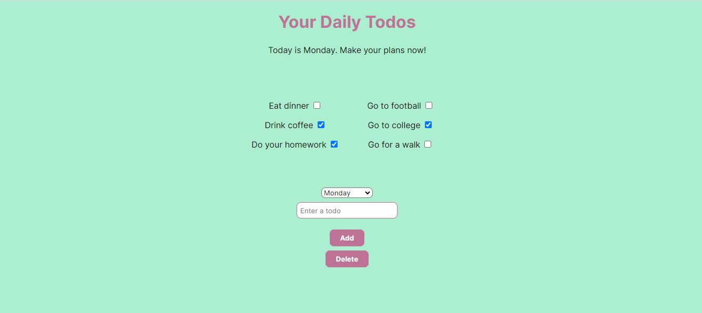
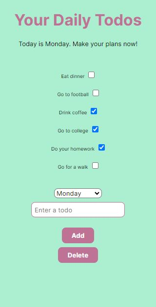

# Todo List - Beginner TypeScript Project

A simple todo list with option to select days, made as a stretch goal for a simple TypeScript project on [Mastering TypeScript](https://www.udemy.com/course/learn-typescript/) course. It contains communication with localStorage, creating interfaces, types and all the necessary todo list logic.

## Table of contents

- [Overview](#overview)
  - [Screenshots](#screenshots)
  - [Link](#link)
- [Process](#process)
  - [Built with](#built-with)
- [Author](#author)

## Overview

Users should be able to:

- select a day of the week
- add todos for the selected day and check/uncheck them
- delete todos for the selected day

### Screenshot

Desktop and mobile design of Todo List.

### Link

- Live Site URL: [Todo List](https://jelenkoo10.github.io/todo-list/)

## Process

### Built with

- HTML
- Flexbox
- CSS Grid
- CSS Media Queries
- [TypeScript](https://www.typescriptlang.org/)

## Author

- GitHub - [https://github.com/jelenkoo10](https://github.com/jelenkoo10)
- Frontend Mentor - [@jelenkoo10](https://www.frontendmentor.io/profile/jelenkoo10)
- LinkedIn - [Veljko Jelenković](https://www.linkedin.com/in/veljko-jelenkovi%C4%87-182981250/)
